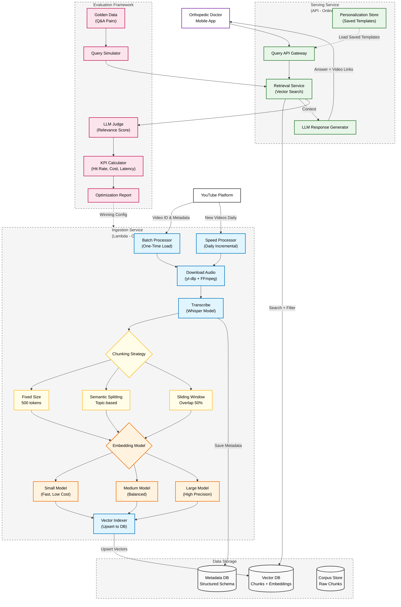

```mermaid

flowchart TD
    %% External Systems
    YT[YouTube Platform]
    Doctor[Orthopedic Doctor<br/>Mobile App]
    
    %% Ingestion Pipeline
    subgraph INGESTION ["Ingestion Service<br/>(Lambda - Offline)"]
        direction TB
        
        Batch["Batch Processor<br/>(One-Time Load)"]
        Speed["Speed Processor<br/>(Daily Incremental)"]
        
        Download["Download Audio<br/>(yt-dlp + FFmpeg)"]
        Transcribe["Transcribe<br/>(Whisper Model)"]
        
        ChunkDec{"Chunking Strategy"}
        Fixed["Fixed Size<br/>500 tokens"]
        Semantic["Semantic Splitting<br/>Topic-based"]
        Sliding["Sliding Window<br/>Overlap 50%"]
        
        EmbedDec{"Embedding Model"}
        Small["Small Model<br/>(Fast, Low Cost)"]
        Medium["Medium Model<br/>(Balanced)"]
        Large["Large Model<br/>(High Precision)"]
        
        VectorIndex["Vector Indexer<br/>(Upsert to DB)"]
    end
    
    %% Serving Layer
    subgraph SERVING ["Serving Service<br/>(API - Online)"]
        direction TB
        
        QueryAPI["Query API Gateway"]
        Personalize["Personalization Store<br/>(Saved Templates)"]
        
        Retrieve["Retrieval Service<br/>(Vector Search)"]
        LLMGen["LLM Response Generator"]
    end
    
    %% Evaluation Framework
    subgraph EVALUATION ["Evaluation Framework<br/>(Capstone Lab)"]
        direction TB
        
        GoldenData["Golden Data<br/>(Q&A Pairs)"]
        Simulator["Query Simulator"]
        Judge["LLM Judge<br/>(Relevance Score)"]
        
        KPIs["KPI Calculator<br/>(Hit Rate, Cost, Latency)"]
        Report["Optimization Report"]
    end
    
    %% Storage Layer
    subgraph STORAGE ["Data Storage"]
        direction TB
        
        MetaDB[(Metadata DB<br/>Structured Schema)]
        VecDB[(Vector DB<br/>Chunks + Embeddings)]
        CorpusDB[(Corpus Store<br/>Raw Chunks)]
    end
    
    %% Connections - Ingestion Flow
    YT -->|Video ID & Metadata| Batch
    YT -->|New Videos Daily| Speed
    
    Batch --> Download
    Speed --> Download
    
    Download --> Transcribe
    Transcribe --> ChunkDec
    
    ChunkDec --> Fixed
    ChunkDec --> Semantic
    ChunkDec --> Sliding
    
    Fixed --> EmbedDec
    Semantic --> EmbedDec
    Sliding --> EmbedDec
    
    EmbedDec --> Small
    EmbedDec --> Medium
    EmbedDec --> Large
    
    Small --> VectorIndex
    Medium --> VectorIndex
    Large --> VectorIndex
    
    VectorIndex -->|Upsert Vectors| VecDB
    Transcribe -->|Save Metadata| MetaDB
    
    %% Connections - Serving Flow
    Doctor --> QueryAPI
    Personalize -.->|Load Saved Templates| QueryAPI
    
    QueryAPI --> Retrieve
    Retrieve -->|Search + Filter| VecDB
    Retrieve -->|Context| LLMGen
    
    LLMGen -->|Answer + Video Links| Doctor
    
    %% Connections - Evaluation Flow
    GoldenData --> Simulator
    Simulator --> Retrieve
    
    Retrieve --> Judge
    Judge --> KPIs
    KPIs --> Report
    
    Report -.->|"Winning Config"| INGESTION
    
    %% Apply Styles for VS Code Compatibility
    style YT fill:#ffffff,stroke:#333,stroke-width:2px,color:#000000
    style Doctor fill:#ffffff,stroke:#7b1fa2,stroke-width:2px,color:#000000
    
    style Batch fill:#e1f5fe,stroke:#0277bd,stroke-width:2px,color:#000000
    style Speed fill:#e1f5fe,stroke:#0277bd,stroke-width:2px,color:#000000
    style Download fill:#e1f5fe,stroke:#0277bd,stroke-width:2px,color:#000000
    style Transcribe fill:#e1f5fe,stroke:#0277bd,stroke-width:2px,color:#000000
    
    style ChunkDec fill:#fffde7,stroke:#fbc02d,stroke-width:2px,color:#000000
    style Fixed fill:#fffde7,stroke:#fbc02d,stroke-width:2px,color:#000000
    style Semantic fill:#fffde7,stroke:#fbc02d,stroke-width:2px,color:#000000
    style Sliding fill:#fffde7,stroke:#fbc02d,stroke-width:2px,color:#000000
    
    style EmbedDec fill:#fff3e0,stroke:#ef6c00,stroke-width:2px,color:#000000
    style Small fill:#fff3e0,stroke:#ef6c00,stroke-width:2px,color:#000000
    style Medium fill:#fff3e0,stroke:#ef6c00,stroke-width:2px,color:#000000
    style Large fill:#fff3e0,stroke:#ef6c00,stroke-width:2px,color:#000000
    
    style VectorIndex fill:#e1f5fe,stroke:#0277bd,stroke-width:2px,color:#000000
    style QueryAPI fill:#e8f5e9,stroke:#2e7d32,stroke-width:2px,color:#000000
    style Personalize fill:#e8f5e9,stroke:#2e7d32,stroke-width:2px,color:#000000
    style Retrieve fill:#e8f5e9,stroke:#2e7d32,stroke-width:2px,color:#000000
    style LLMGen fill:#e8f5e9,stroke:#2e7d32,stroke-width:2px,color:#000000
    
    style GoldenData fill:#fce4ec,stroke:#c2185b,stroke-width:2px,color:#000000
    style Simulator fill:#fce4ec,stroke:#c2185b,stroke-width:2px,color:#000000
    style Judge fill:#fce4ec,stroke:#c2185b,stroke-width:2px,color:#000000
    style KPIs fill:#fce4ec,stroke:#c2185b,stroke-width:2px,color:#000000
    style Report fill:#fce4ec,stroke:#c2185b,stroke-width:2px,color:#000000
    
    style MetaDB fill:#f9f9f9,stroke:#333,stroke-width:2px,color:#000000
    style VecDB fill:#f9f9f9,stroke:#333,stroke-width:2px,color:#000000
    style CorpusDB fill:#f9f9f9,stroke:#333,stroke-width:2px,color:#000000
    
    style INGESTION fill:#f5f5f5,stroke:#333,stroke-dasharray: 5 5
    style SERVING fill:#f5f5f5,stroke:#333,stroke-dasharray: 5 5
    style EVALUATION fill:#f5f5f5,stroke:#333,stroke-dasharray: 5 5
    style STORAGE fill:#f5f5f5,stroke:#333,stroke-dasharray: 5 5

```
