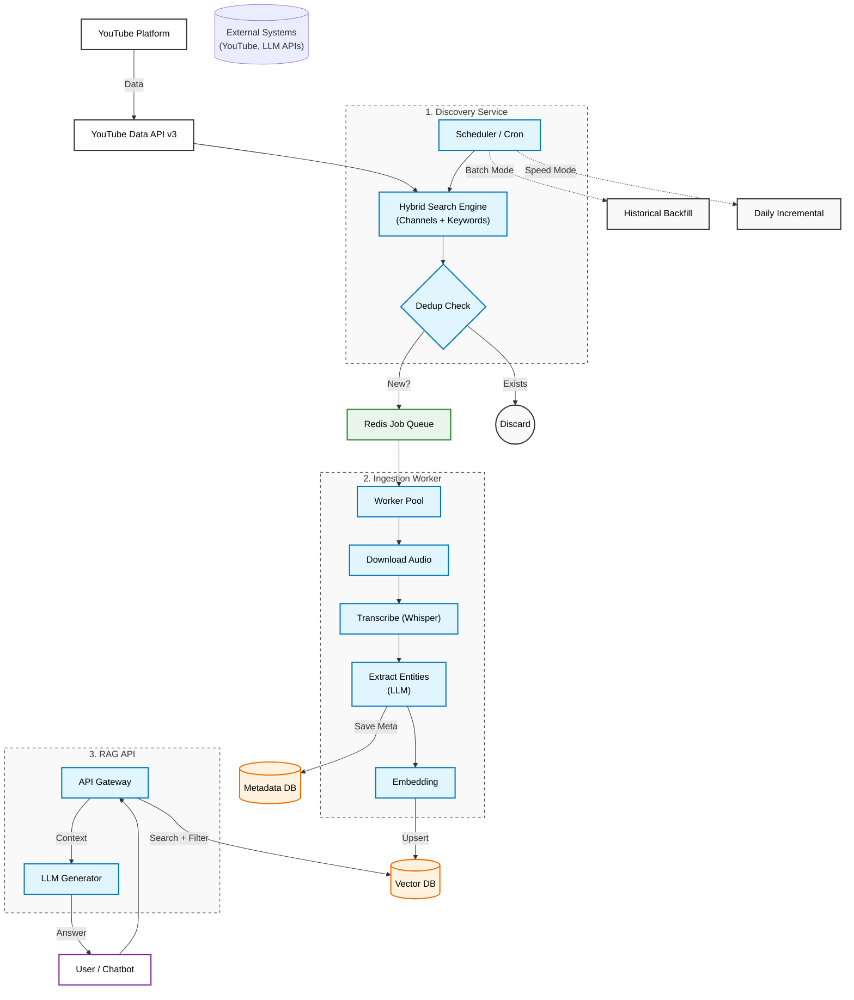

```mermaid
flowchart TD
    YT[YouTube Platform]
    API[YouTube Data API v3]
    
    subgraph DISCOVERY ["1. Discovery Service"]
        direction TB
        Sched["Scheduler / Cron"]
        Search["Hybrid Search Engine<br/>(Channels + Keywords)"]
        Dedup{"Dedup Check"}
    end

    RedisQueue[Redis Job Queue]

    subgraph INGESTION ["2. Ingestion Worker"]
        direction TB
        Worker["Worker Pool"]
        DL["Download Audio"]
        Trans["Transcribe (Whisper)"]
        Extract["Extract Entities<br/>(LLM)"]
        Embed["Embedding"]
    end

    MetaDB[(Metadata DB)]
    VecDB[(Vector DB)]

    subgraph SERVING ["3. RAG API"]
        direction TB
        Gateway["API Gateway"]
        GenLLM["LLM Generator"]
    end

    User[User / Chatbot]
    
    ExternalSystems[("External Systems<br/>(YouTube, LLM APIs)")]

    YT -->|Data| API
    API --> Search
    
    Sched --> Search
    Search --> Dedup
    Dedup -- New? --> RedisQueue
    Dedup -- Exists --> Discard((Discard))

    RedisQueue --> Worker
    Worker --> DL --> Trans --> Extract --> Embed
    
    Embed -->|Upsert| VecDB
    Extract -->|Save Meta| MetaDB

    User --> Gateway
    Gateway -->|Search + Filter| VecDB
    Gateway -->|Context| GenLLM
    GenLLM -->|Answer| User

    Sched -.->|"Batch Mode"| Note1["Historical Backfill"]
    Sched -.->|"Speed Mode"| Note2["Daily Incremental"]

    style YT fill:#ffffff,stroke:#333,stroke-width:2px,color:#000000
    style API fill:#ffffff,stroke:#333,stroke-width:2px,color:#000000
    style User fill:#ffffff,stroke:#7b1fa2,stroke-width:2px,color:#000000
    style Discard fill:#f9f9f9,stroke:#333,stroke-width:2px,color:#000000
    style Note1 fill:#f9f9f9,stroke:#333,stroke-width:2px,color:#000000
    style Note2 fill:#f9f9f9,stroke:#333,stroke-width:2px,color:#000000

    style Sched fill:#e1f5fe,stroke:#0277bd,stroke-width:2px,color:#000000
    style Search fill:#e1f5fe,stroke:#0277bd,stroke-width:2px,color:#000000
    style Dedup fill:#e1f5fe,stroke:#0277bd,stroke-width:2px,color:#000000

    style RedisQueue fill:#e8f5e9,stroke:#2e7d32,stroke-width:2px,color:#000000

    style Worker fill:#e1f5fe,stroke:#0277bd,stroke-width:2px,color:#000000
    style DL fill:#e1f5fe,stroke:#0277bd,stroke-width:2px,color:#000000
    style Trans fill:#e1f5fe,stroke:#0277bd,stroke-width:2px,color:#000000
    style Extract fill:#e1f5fe,stroke:#0277bd,stroke-width:2px,color:#000000
    style Embed fill:#e1f5fe,stroke:#0277bd,stroke-width:2px,color:#000000

    style MetaDB fill:#fff3e0,stroke:#ef6c00,stroke-width:2px,color:#000000
    style VecDB fill:#fff3e0,stroke:#ef6c00,stroke-width:2px,color:#000000

    style Gateway fill:#e1f5fe,stroke:#0277bd,stroke-width:2px,color:#000000
    style GenLLM fill:#e1f5fe,stroke:#0277bd,stroke-width:2px,color:#000000

    style DISCOVERY fill:#f9f9f9,stroke:#333,stroke-dasharray: 5 5
    style INGESTION fill:#f9f9f9,stroke:#333,stroke-dasharray: 5 5
    style SERVING fill:#f9f9f9,stroke:#333,stroke-dasharray: 5 5
```
